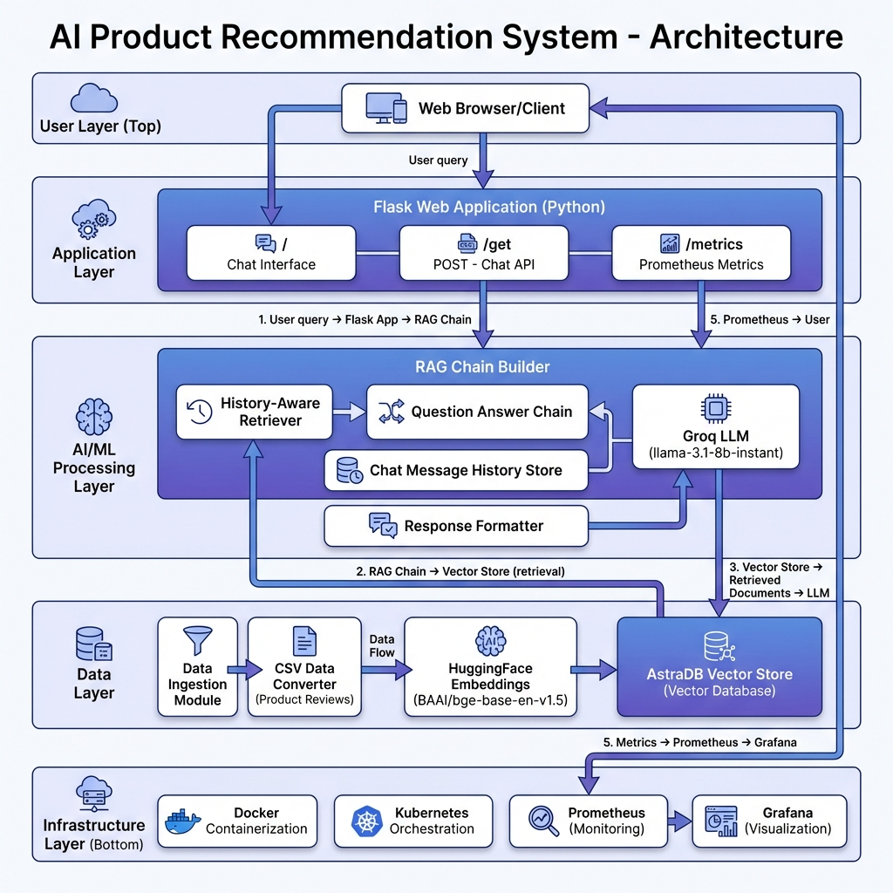

# 🛍️ AI Product Recommendation System

A production-ready, AI-powered product recommendation chatbot built with Flask, LangChain, and deployed on Kubernetes with comprehensive monitoring.

## 🎬 Live Demo


*Watch the live demo above to see the AI Product Assistant in action!*

## 🌟 Features

### 🤖 AI-Powered Chatbot
- **RAG (Retrieval-Augmented Generation)** implementation using LangChain
- **Conversational AI** with chat history and context awareness
- **Product-specific recommendations** based on product reviews and data
- **Styled responses** with automatic formatting and visual enhancement
- **Real-time responses** with session management

### 🏗️ Architecture & Tech Stack
- **Backend**: Flask (Python 3.10)
- **AI/ML**: LangChain, HuggingFace Embeddings, Groq LLM
- **Vector Database**: AstraDB (DataStax)
- **Frontend**: Bootstrap 5, jQuery, Custom CSS with Glass-morphism design
- **Containerization**: Docker
- **Orchestration**: Kubernetes
- **Monitoring**: Prometheus + Grafana
- **Observability**: Custom metrics, logging, error handling

### 📊 Monitoring & Observability
- **Prometheus metrics** for HTTP requests and performance
- **Grafana dashboards** for visualization
- **Custom logging** with daily log rotation
- **Error tracking** with detailed exception handling
- **Health checks** and service monitoring

### 🚀 Production Features
- **Horizontal scaling** with Kubernetes
- **Load balancing** with LoadBalancer service
- **Environment-based configuration**
- **Secret management** for API keys
- **Modular code structure** for maintainability

## 🏛️ System Architecture



### Architecture Overview

The system follows a modern, layered architecture designed for scalability, maintainability, and production readiness:

#### **User Layer**
- Web-based chat interface accessible through any modern browser
- Real-time interaction with the AI assistant

#### **Application Layer**
- **Flask Web Application**: Lightweight Python web framework serving the frontend and API
  - `GET /` - Renders the chat interface
  - `POST /get` - Processes user queries and returns AI-generated responses
  - `GET /metrics` - Exposes Prometheus metrics for monitoring

#### **AI/ML Processing Layer (RAG Pipeline)**
- **RAG Chain Builder**: Orchestrates the entire retrieval-augmented generation workflow
  - **History-Aware Retriever**: Contextualizes queries using conversation history
  - **Question Answer Chain**: Combines retrieved context with LLM reasoning
  - **Chat Message History Store**: Maintains conversation state per session
  - **Groq LLM**: Fast inference using `llama-3.1-8b-instant` model
  - **Response Formatter**: Styles and structures LLM outputs for optimal UX

#### **Data Layer**
- **Data Ingestion Module**: Processes product review datasets
- **CSV Data Converter**: Transforms raw CSV data into document format
- **HuggingFace Embeddings**: Generates semantic embeddings using `BAAI/bge-base-en-v1.5`
- **AstraDB Vector Store**: Cloud-native vector database for similarity search

#### **Infrastructure Layer**
- **Docker**: Containerization for consistent deployment across environments
- **Kubernetes**: Container orchestration for scaling and reliability
- **Prometheus**: Metrics collection and alerting
- **Grafana**: Dashboard visualization and monitoring

### Data Flow

1. **User Query** → Flask receives the request via `/get` endpoint
2. **RAG Processing** → Query is processed through the RAG chain with conversation history
3. **Vector Retrieval** → Semantic search retrieves top 3 relevant product reviews from AstraDB
4. **LLM Generation** → Groq LLM generates contextual response using retrieved documents
5. **Response Formatting** → Response is styled and formatted for rich display
6. **User Response** → Formatted response is returned to the user interface
7. **Metrics Collection** → All requests are tracked and exported to Prometheus

## 📁 Project Structure

```
Product Recommendation System/
├── app.py                          # Flask application entry point
├── requirements.txt                # Python dependencies
├── setup.py                       # Package configuration
├── Dockerfile                     # Container configuration
├── flask-deployment.yaml          # Kubernetes deployment
├── src/                           # Source code modules
│   ├── config.py                  # Configuration management
│   ├── data_ingestion.py          # Vector store setup
│   ├── data_converter.py          # CSV to document conversion
│   ├── rag_chain.py               # RAG chain implementation
│   └── response_formatter.py      # LLM response styling and formatting
├── utils/                         # Utility modules
│   ├── custom_exception.py        # Custom exception handling
│   └── logger.py                  # Logging configuration
├── templates/                     # HTML templates
│   └── index.html                 # Chat interface
├── static/                        # Static assets
│   └── style.css                  # Custom styling
├── data/                          # Data files
│   └── product_reviews.csv        # Product review dataset
├── prometheus/                    # Monitoring configuration
│   ├── prometheus-configmap.yaml  # Prometheus config
│   └── prometheus-deployment.yaml # Prometheus deployment
└── grafana/                       # Visualization
    └── grafana-deployment.yaml    # Grafana deployment
```

## 🚀 Quick Start

### Prerequisites
- Python 3.10+
- Docker
- Kubernetes cluster
- AstraDB account
- Groq API key

### 1. Environment Setup

Create a `.env` file in the root directory:

```bash
# AstraDB Configuration
ASTRA_DB_API_ENDPOINT=your_astra_db_endpoint
ASTRA_DB_APPLICATION_TOKEN=your_astra_db_token
ASTRA_DB_KEYSPACE=your_keyspace

# Groq API Configuration
GROQ_API_KEY=your_groq_api_key

# HuggingFace API Configuration (for embeddings)
HUGGINGFACE_API_KEY=your_huggingface_api_key
```

### 🔑 Getting API Keys

1. **HuggingFace API Key**:
   - Go to [HuggingFace Settings](https://huggingface.co/settings/tokens)
   - Create a new token with "Read" permissions
   - Copy the token to your `.env` file

2. **Groq API Key**:
   - Visit [Groq Console](https://console.groq.com/)
   - Create an account and generate an API key
   - Copy the key to your `.env` file

3. **AstraDB Setup**:
   - Sign up at [DataStax Astra](https://astra.datastax.com/)
   - Create a new database
   - Get your API endpoint, application token, and keyspace

### 2. Local Development

```bash
# Clone the repository
git clone <repository-url>
cd Product-Recommendation-System

# Create virtual environment
python -m venv venv
source venv/bin/activate  # On Windows: venv\Scripts\activate

# Install dependencies
pip install -e .

# Run the application
python app.py
```

The application will be available at `http://localhost:5000`

### 3. Docker Deployment

```bash
# Build the Docker image
docker build -t flask-app:latest .

# Run the container
docker run -p 5000:5000 --env-file .env flask-app:latest
```

### 4. Kubernetes Deployment

#### Deploy the Application
```bash
# Create namespace
kubectl create namespace default

# Create secrets (replace with your actual values)
kubectl create secret generic llmops-secrets \
  --from-literal=ASTRA_DB_API_ENDPOINT=your_endpoint \
  --from-literal=ASTRA_DB_APPLICATION_TOKEN=your_token \
  --from-literal=ASTRA_DB_KEYSPACE=your_keyspace \
  --from-literal=GROQ_API_KEY=your_groq_key \
  --from-literal=HUGGINGFACE_API_KEY=your_huggingface_key

# Deploy the application
kubectl apply -f flask-deployment.yaml
```

#### Deploy Monitoring Stack
```bash
# Create monitoring namespace
kubectl create namespace monitoring

# Deploy Prometheus
kubectl apply -f prometheus/prometheus-configmap.yaml
kubectl apply -f prometheus/prometheus-deployment.yaml

# Deploy Grafana
kubectl apply -f grafana/grafana-deployment.yaml
```

#### Access the Services
```bash
# Get service URLs
kubectl get services

# Access the application (LoadBalancer)
# Use the external IP from flask-service

# Access Prometheus (NodePort)
# http://your-cluster-ip:32001

# Access Grafana (NodePort)
# http://your-cluster-ip:32000
```

## 🔧 Configuration

### Model Configuration
The system uses the following models (configurable in `src/config.py`):
- **Embedding Model**: `BAAI/bge-base-en-v1.5`
- **LLM Model**: `llama-3.1-8b-instant` (Groq)

### Vector Store Configuration
- **Database**: AstraDB (DataStax)
- **Collection**: `db_recommender`
- **Retrieval**: Top 3 most similar documents

### Monitoring Configuration
- **Scrape Interval**: 15 seconds
- **Metrics Endpoint**: `/metrics`
- **Log Rotation**: Daily logs in `logs/` directory

## 📊 API Endpoints

### Web Interface
- `GET /` - Chat interface homepage

### API Endpoints
- `POST /get` - Send message to chatbot
  - **Input**: `msg` (form data)
  - **Output**: Styled HTML response with automatic formatting

### Monitoring
- `GET /metrics` - Prometheus metrics endpoint

## 🎯 Usage Examples

### Chat Interface
1. Open the web interface
2. Type your product-related questions
3. Get AI-powered recommendations based on product reviews and data

### Example Queries
- "What are the best smartphones under $500?"
- "Tell me about laptop reviews"
- "Which headphones have good sound quality?"
- "Compare gaming laptops vs business laptops"
- "Recommend products for students"
- "Best budget smartphones with good cameras"

## 🔍 Monitoring & Observability

### Prometheus Metrics
- `http_requests_total` - Total HTTP requests counter
- Custom application metrics
- System performance metrics

### Grafana Dashboards
- Request rate and response time
- Error rates and status codes
- System resource utilization
- Custom application metrics

### Logging
- Daily log files in `logs/` directory
- Structured logging with timestamps
- Error tracking with file and line numbers

## 🛠️ Development

### Adding New Features
1. Create modules in `src/` directory
2. Update `requirements.txt` for new dependencies
3. Add configuration in `src/config.py`
4. Update Docker and Kubernetes manifests

### Testing
```bash
# Run the application locally
python app.py

# Test the API
curl -X POST http://localhost:5000/get -d "msg=Hello"
```

### Code Structure
- **Modular design** for easy maintenance
- **Configuration management** with environment variables
- **Error handling** with custom exceptions
- **Logging** for debugging and monitoring

## 🚀 Production Considerations

### Security
- API keys stored as Kubernetes secrets
- Environment-based configuration
- Input validation and sanitization

### Scalability
- Horizontal scaling with Kubernetes
- Load balancing with LoadBalancer service
- Stateless application design

### Reliability
- Health checks and monitoring
- Error handling and logging
- Graceful degradation

## 📈 Performance

### Optimization Features
- **Vector caching** for faster retrieval
- **Session management** for conversation context
- **Efficient document processing**
- **Optimized embedding model**

### Monitoring
- Real-time performance metrics
- Resource utilization tracking
- Response time monitoring

## 🔧 Troubleshooting

### Common Issues

#### 1. HuggingFace Authentication Error (401 Unauthorized)
```
huggingface_hub.errors.HfHubHTTPError: 401 Client Error: Unauthorized
```

**Solution**: 
- Get a HuggingFace API token from [HuggingFace Settings](https://huggingface.co/settings/tokens)
- Add `HUGGINGFACE_API_KEY=your_token` to your `.env` file
- Restart the application

#### 2. AstraDB Connection Issues
```
astra_db.errors.DatabaseError: Unable to connect to AstraDB
```

**Solution**:
- Verify your AstraDB credentials in `.env`
- Check if your database is active in the Astra console
- Ensure your IP is whitelisted (if required)

#### 3. Groq API Rate Limits
```
groq.RateLimitError: Rate limit exceeded
```

**Solution**:
- Check your Groq API usage limits
- Implement request throttling if needed
- Consider upgrading your Groq plan

#### 4. Kubernetes Deployment Issues
```
Error: secret "llmops-secrets" not found
```

**Solution**:
- Ensure you've created the Kubernetes secret with all required keys
- Verify the secret exists: `kubectl get secrets`
- Check secret contents: `kubectl describe secret llmops-secrets`

### Alternative Embedding Models

If you encounter issues with the default embedding model, you can switch to alternatives:

```python
# In src/config.py, change EMBEDDING_MODEL to:
EMBEDDING_MODEL = "sentence-transformers/all-MiniLM-L6-v2"  # Smaller, faster
# or
EMBEDDING_MODEL = "sentence-transformers/all-mpnet-base-v2"  # Better quality
```

## 🤝 Contributing

1. Fork the repository
2. Create a feature branch
3. Make your changes
4. Add tests if applicable
5. Submit a pull request

## 📄 License

This project is licensed under the MIT License.

## 👨‍💻 Author

**Harsha Vardhan**
- GitHub: [@yourusername](https://github.com/yourusername)
- LinkedIn: [Your LinkedIn](https://linkedin.com/in/yourprofile)

## 🙏 Acknowledgments

- LangChain for RAG implementation
- DataStax AstraDB for vector storage
- Groq for fast LLM inference
- Flask for web framework
- Kubernetes for orchestration
- Prometheus & Grafana for monitoring

---

**Built with ❤️ for the AI/ML community**
